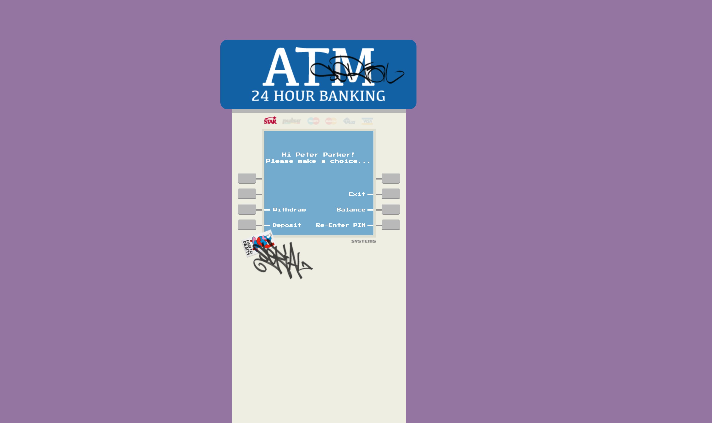

# ATM Application

A functional ATM (Automated Teller Machine) demo application built with React, TypeScript, and Express.

## Architecture

### Frontend
- React 19 with TypeScript
- Redux Toolkit for state management
- Vite for development and building
- Custom CSS styling

### Backend
- Express.js with TypeScript
- RESTful API endpoints
- Mock data for user accounts and transactions
- CORS enabled for frontend communication

## Features

- PIN-based authentication
- Account balance checking
- Cash withdrawal with validation
- Cash deposit functionality
- Transaction history tracking
- Real-time balance updates
- Error handling and loading states
- Responsive design
- Card type display (Visa, Mastercard, Amex)

## Development Process

### Phase 1: Project Setup
Started with basic React + TypeScript setup using Vite. Initially struggled with Redux Toolkit configuration but eventually got it working smoothly.

### Phase 2: Backend Development
Built a simple Express server with TypeScript. Had to figure out proper CORS configuration for local development.

### Phase 3: State Management
Implemented Redux slices for auth, account, and transactions. Faced some challenges with async thunks and duplicate action types (fixed in commit history).

### Phase 4: UI Implementation
Created ATM-like interface with custom CSS. Spent time getting the styling to look authentic.

### Phase 5: Integration & Testing
Connected frontend to backend. Debugged various API integration issues.

## Demo Credentials

For testing purposes, use these demo PINs:

- PIN: 1234 - John Doe (Visa Card, Balance: $1,500.00)
- PIN: 5678 - Jane Smith (Mastercard, Balance: $2,300.50)  
- PIN: 9999 - Mike Johnson (Amex, Balance: $750.25)

## Getting Started

### Prerequisites
- Node.js (v16 or higher)
- npm or yarn

### Installation & Running

1. **Backend Server:**
```bash
cd backend
npm install
npm run dev
```
Server runs on http://localhost:5000

2. **Frontend Application:**
```bash
cd frontend
npm install
npm run dev
```
Application runs on http://localhost:5173

## API Endpoints

| Method | Endpoint | Description |
|--------|----------|-------------|
| POST | `/api/auth` | Authenticate user with PIN |
| GET | `/api/balance/:userId` | Get account balance |
| POST | `/api/withdraw` | Withdraw money |
| POST | `/api/deposit` | Deposit money |

## Usage

1. Open the application in your browser
2. Enter one of the demo PINs (1234, 5678, or 9999)
3. Use the ATM interface to:
   - Check your balance
   - Withdraw cash (with validation)
   - Deposit funds
   - View transaction history

## Technical Notes

- All transactions are simulated (no real money involved)
- Data is stored in memory (resets on server restart)
- Responsive design works on mobile and desktop
- Error handling for invalid inputs and network issues

## Future Improvements

- Add persistent database storage
- Implement session timeout
- Add transaction receipts
- Enhanced security features
- Multi-language support

## Project Structure

```
├── backend/                 # Express.js API server
│   ├── src/
│   │   ├── controllers/    # API route handlers
│   │   ├── data/          # Mock data and utilities
│   │   ├── routes/        # Express routes
│   │   └── types/         # TypeScript type definitions
├── frontend/               # React application
│   ├── src/
│   │   ├── components/    # React components
│   │   ├── features/      # Redux slices
│   │   ├── services/      # API services
│   │   ├── store/         # Redux store configuration
│   │   ├── types/         # TypeScript types
│   │   └── utils/         # Utility functions
└── assets/                # Original design mockups
```

---

## Original Assignment

Your task in this challenge is to build a demo web app that is a functional ATM machine. Please use a stubbed backend as if you were interacting with a server

### Guidelines:

- Please work in React, Typescript, and utilize any additional frameworks or libraries as needed.
- Incorporate state management effectively in your application.
- Utilize React hooks for managing state and side effects.
- Match the provided mocks as closely as possible.
- Please use provided assets.
- A user should be able to check their balance, withdraw funds, and deposit funds after entering their PIN at a minimum.
- Funds should be correctly reflected after a deposit or withdrawal.
- A user's card type should be highlighted once they have entered their correct PIN.

- consider setting up a NodeJS backend server with Express to handle all transactions on the server.

### Mocks:



